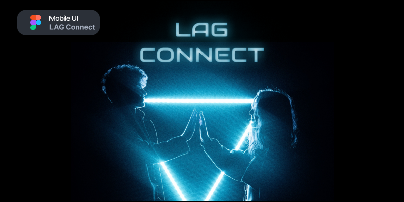

# LAG Connect

## Descrição

O **LAG Connect** é uma rede social criada para programadores e designers compartilharem projetos públicos e particulares em um ecossistema único. Este projeto está atualmente na fase de design, onde estamos trabalhando na criação de um ambiente digital intuitivo e eficiente que atenderá às necessidades da nossa comunidade de desenvolvedores e designers.

## Imagens do projeto

## Status do Projeto

O projeto "LAG Connect" está na fase de design, e nossa equipe está trabalhando arduamente para criar uma experiência de usuário incrível e funcional. Nossos próximos passos incluem a implementação dos designs e a construção da plataforma.

## Contribuições

Nós valorizamos e encorajamos contribuições da comunidade. Se você deseja contribuir para o projeto "LAG Connect", sinta-se à vontade para entrar em contato conosco. Juntos, podemos fazer desta rede social uma realidade incrível para programadores e designers.

## Como Contribuir

1. Faça um fork do repositório.
2. Crie uma branch com a sua feature: `git checkout -b minha-feature`.
3. Faça commit das suas mudanças: `git commit -m 'Adicionei uma nova feature'`.
4. Envie para o seu fork: `git push origin minha-feature`.
5. Abra um Pull Request.

## Contato

Se você tiver alguma pergunta ou sugestão, por favor, entre em contato conosco por meio dos seguintes canais:

- E-mail: adriellisonki@gmail.com
- Instagram: [@adriellison_fer](https://instagram.com/adriellison_fer)
- Website: [beacons.ai](https://beacons.ai/adriellison)
- Website: [lagconnect.com](https://lagconnect.com)

Agradecemos o seu interesse no "LAG Connect". Juntos, estamos construindo um ecossistema único para programadores e designers compartilharem projetos e ideias.

Obrigado por fazer parte deste projeto empolgante!
